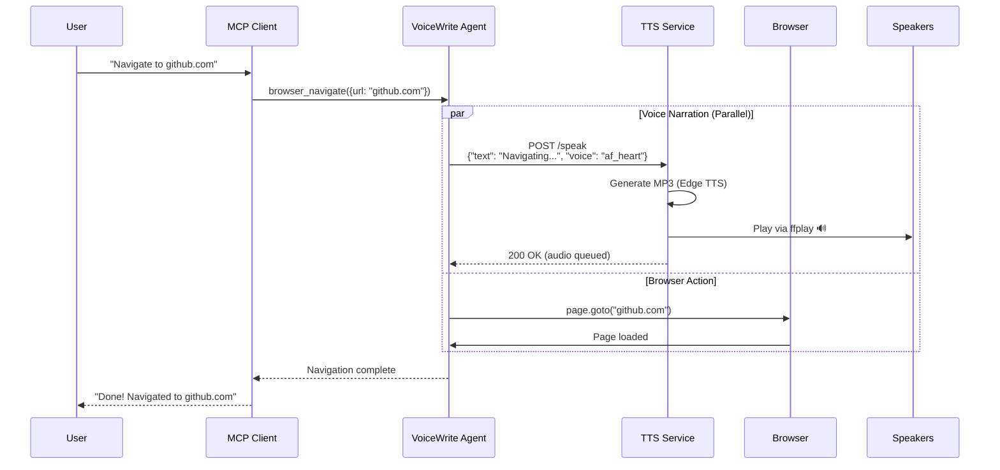
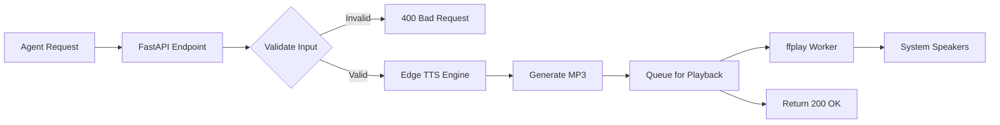

# 🏗 VoiceWrite MCP - Architecture Documentation

**Technical Deep-Dive into System Design, Components, and Data Flow**

---

## 📋 Table of Contents

1. [System Overview](#system-overview)
2. [High-Level Architecture](#high-level-architecture)
3. [Component Architecture](#component-architecture)
4. [Data Flow](#data-flow)
5. [Technology Stack](#technology-stack)
6. [Design Decisions](#design-decisions)
7. [Scalability Considerations](#scalability-considerations)
8. [Security Architecture](#security-architecture)
9. [Performance Optimization](#performance-optimization)
10. [Deployment Architecture](#deployment-architecture)

---

## System Overview

VoiceWrite MCP is a **distributed microservices architecture** consisting of two main components:

1. **Node.js MCP Agent** - Browser automation and MCP protocol handler
2. **Python TTS Service** - Text-to-speech generation and audio playback

These components communicate via HTTP REST APIs and work together to provide voice-narrated browser automation.

### Key Architectural Principles

- **Separation of Concerns** - TTS isolated from browser automation
- **Loose Coupling** - Components communicate via well-defined APIs
- **Fault Tolerance** - Graceful degradation on component failure
- **Scalability** - Each component can scale independently
- **Observability** - Comprehensive logging and health checks

---

## High-Level Architecture

```
┌─────────────────────────────────────────────────────────────────────────┐
│                         VoiceWrite MCP System                            │
│                                                                          │
│  ┌─────────────┐         ┌─────────────┐         ┌─────────────┐        │
│  │   MCP       │         │  VoiceWrite │         │   Browser   │        │
│  │   Client    │────────▶│   Agent     │────────▶│  (Chromium) │        │
│  │             │         │  (Node.js)  │         │ (Playwright)│        │
│  │  - Claude   │         │             │         │             │        │
│  │  - Cursor   │         │             │         │             │        │
│  │  - VS Code  │         │             │         │             │        │
│  └─────────────┘         └──────┬──────┘         └──────┬──────┘        │
│                                 │                       │               │
│                                 │ MCP Protocol          │ DOM Access    │
│                                 │ (JSON-RPC)            │               │
│                                 ▼                       ▼               │
│                          ┌─────────────┐         ┌─────────────┐        │
│                          │   TTS       │         │   Overlay   │        │
│                          │   Service   │         │  Injector   │        │
│                          │  (Python)   │         │  (JS/CSS)   │        │
│                          │             │         │             │        │
│                          │ - FastAPI   │         │ - Red Bubble│        │
│                          │ - Edge TTS  │         │ - Alt+J     │        │
│                          │ - ffplay    │         │ - Mute      │        │
│                          └──────┬──────┘         └─────────────┘        │
│                                 │                                        │
│                                 │ Audio Output                           │
│                                 ▼                                        │
│                          ┌─────────────┐                                │
│                          │   System    │                                │
│                          │   Speakers  │                                │
│                          │   (USB)     │                                │
│                          └─────────────┘                                │
│                                                                          │
└─────────────────────────────────────────────────────────────────────────┘
```

---

## Component Architecture

### 1. MCP Agent (Node.js)

```
┌─────────────────────────────────────────────────────────────┐
│                  VoiceWrite MCP Agent                        │
│                     (node-agent/)                            │
│                                                              │
│  ┌──────────────────────────────────────────────────────┐   │
│  │                   MCP Server                          │   │
│  │  - Protocol Handler (JSON-RPC)                        │   │
│  │  - Tool Registration                                  │   │
│  │  - Request/Response Management                        │   │
│  └──────────────────────────────────────────────────────┘   │
│                           │                                  │
│                           ▼                                  │
│  ┌──────────────────────────────────────────────────────┐   │
│  │                  Tool Handlers                        │   │
│  │  - browser_navigate()                                 │   │
│  │  - browser_click()                                    │   │
│  │  - browser_type()                                     │   │
│  │  - browser_scroll()                                   │   │
│  │  - browser_screenshot()                               │   │
│  │  - browser_evaluate()                                 │   │
│  └──────────────────────────────────────────────────────┘   │
│                           │                                  │
│                           ▼                                  │
│  ┌──────────────────────────────────────────────────────┐   │
│  │               Narration Engine                        │   │
│  │  - Voice Mode Manager (silent/minimal/full)           │   │
│  │  - TTS Client (HTTP)                                  │   │
│  │  - Rate Limiter (800ms between calls)                 │   │
│  │  - Retry Logic (2 retries, 500ms delay)               │   │
│  └──────────────────────────────────────────────────────┘   │
│                           │                                  │
│                           ▼                                  │
│  ┌──────────────────────────────────────────────────────┐   │
│  │              Playwright Controller                    │   │
│  │  - Browser Launch (Chromium)                          │   │
│  │  - Context Management                                 │   │
│  │  - Page Navigation                                    │   │
│  │  - Element Interaction                                │   │
│  │  - Screenshot Capture                                 │   │
│  └──────────────────────────────────────────────────────┘   │
│                           │                                  │
│                           ▼                                  │
│  ┌──────────────────────────────────────────────────────┐   │
│  │               Overlay Injector                        │   │
│  │  - CSS Injection (Red Bubble)                         │   │
│  │  - JavaScript Injection (Audio Player)                │   │
│  │  - Event Listeners (Alt+J, Click)                     │   │
│  │  - State Management (Muted/Speaking)                  │   │
│  └──────────────────────────────────────────────────────┘   │
│                                                              │
└─────────────────────────────────────────────────────────────┘
```

### 2. TTS Service (Python)

```
┌─────────────────────────────────────────────────────────────┐
│                    TTS Service                               │
│                   (tts-service/)                             │
│                                                              │
│  ┌──────────────────────────────────────────────────────┐   │
│  │                  FastAPI Server                       │   │
│  │  - REST Endpoints                                     │   │
│  │    • GET  /health                                     │   │
│  │    • GET  /voices                                     │   │
│  │    • POST /speak (async)                              │   │
│  │    • POST /speak-sync (blocking)                      │   │
│  │  - Request Validation                                 │   │
│  │  - Error Handling                                     │   │
│  └──────────────────────────────────────────────────────┘   │
│                           │                                  │
│                           ▼                                  │
│  ┌──────────────────────────────────────────────────────┐   │
│  │               TTS Engine                              │   │
│  │  - Edge TTS Integration                               │   │
│  │  - Voice Selection (10+ voices)                       │   │
│  │  - Speed Control (0.5x - 2.0x)                        │   │
│  │  - Text Preprocessing                                 │   │
│  │  - MP3 Generation                                     │   │
│  └──────────────────────────────────────────────────────┘   │
│                           │                                  │
│                           ▼                                  │
│  ┌──────────────────────────────────────────────────────┐   │
│  │            Audio Playback Worker                      │   │
│  │  - Async Queue (asyncio.Queue)                        │   │
│  │  - ffplay Integration                                 │   │
│  │  - Fallback to aplay                                  │   │
│  │  - File Cleanup                                       │   │
│  └──────────────────────────────────────────────────────┘   │
│                           │                                  │
│                           ▼                                  │
│  ┌──────────────────────────────────────────────────────┐   │
│  │              System Audio Output                      │   │
│  │  - PulseAudio/ALSA                                    │   │
│  │  - Docker Audio Mount (/dev/snd)                      │   │
│  │  - Speaker/Headphone Output                           │   │
│  └──────────────────────────────────────────────────────┘   │
│                                                              │
└─────────────────────────────────────────────────────────────┘
```

---

## Data Flow

### Complete Request Flow



### TTS Request Flow



### Overlay Injection Flow

```
Browser Page Load
       │
       ▼
┌─────────────────┐
│ initScript      │
│ (Overlay JS)    │
└────────┬────────┘
         │
         ▼
┌─────────────────┐
│ Create DOM      │
│ - Red Bubble    │
│ - Tooltip       │
│ - SVG Icon      │
└────────┬────────┘
         │
         ▼
┌─────────────────┐
│ Add Event       │
│ Listeners       │
│ - Alt+J (Mute)  │
│ - Click (Toggle)│
└────────┬────────┘
         │
         ▼
┌─────────────────┐
│ Define Global   │
│ Function        │
│ playVoiceWriteAudio()│
└────────┬────────┘
         │
         ▼
┌─────────────────┐
│ Ready for       │
│ Audio Playback  │
└─────────────────┘
```

---

## Technology Stack

### Backend Services

| Component | Technology | Version | Purpose |
|-----------|------------|---------|---------|
| **MCP Agent** | Node.js | 18+ | Runtime environment |
| **MCP SDK** | @modelcontextprotocol/sdk | 1.25+ | Protocol implementation |
| **Browser** | Playwright | 1.59+ | Browser automation |
| **Language** | TypeScript | 5.0+ | Type-safe JavaScript |

### TTS Service

| Component | Technology | Version | Purpose |
|-----------|------------|---------|---------|
| **Runtime** | Python | 3.10+ | Runtime environment |
| **Web Framework** | FastAPI | 0.109+ | REST API server |
| **TTS Engine** | edge-tts | 7.2+ | Text-to-speech |
| **Audio Player** | FFmpeg (ffplay) | 7.1+ | Audio playback |
| **ASGI Server** | Uvicorn | 0.27+ | Async server |

### Infrastructure

| Component | Technology | Version | Purpose |
|-----------|------------|---------|---------|
| **Containerization** | Docker | 24+ | Container runtime |
| **Orchestration** | Docker Compose | 2.24+ | Multi-container setup |
| **Audio System** | PulseAudio/ALSA | - | System audio output |

---

## Design Decisions

### 1. Microservices vs Monolith

**Decision:** Microservices (2 separate services)

**Rationale:**
- Python has better TTS libraries (edge-tts)
- Node.js has better MCP SDK support
- Independent scaling possible
- Fault isolation (TTS failure doesn't crash agent)
- Easier testing and development

**Trade-offs:**
- Network overhead (HTTP calls)
- More complex deployment
- Inter-service communication latency

### 2. Edge TTS vs alternatives

**Decision:** Edge TTS (Microsoft Edge TTS API)

**Rationale:**
- High-quality neural voices
- Free to use (no API key required)
- 10+ voice options
- Fast generation (<2 seconds)
- No local model downloads (500MB+)

**Alternatives Considered:**
- **Kokoro-ONNX:** Required large model downloads, compatibility issues
- **Google TTS:** API key required, cost concerns
- **Amazon Polly:** Cost, AWS dependency

### 3. ffplay for Audio Playback

**Decision:** ffplay (FFmpeg) for audio playback

**Rationale:**
- Cross-platform (Linux, macOS, Windows)
- Reliable MP3 playback
- Low latency
- Well-maintained
- Docker-compatible

**Alternatives Considered:**
- **aplay:** Linux-only, WAV only
- **pulseaudio:** More complex setup
- **pyaudio:** Additional dependencies, compatibility issues

### 4. Async vs Sync TTS

**Decision:** Support both async (`/speak`) and sync (`/speak-sync`)

**Rationale:**
- **Async:** Agent doesn't block, better UX
- **Sync:** Testing, debugging, guaranteed playback before action
- Flexibility for different use cases

### 5. Overlay Design

**Decision:** Injected JavaScript/CSS overlay

**Rationale:**
- No browser extension required
- Works in all contexts
- Easy to update
- Minimal performance impact
- Self-contained

**Trade-offs:**
- Injected on every page load
- Requires script injection permissions

---

## Scalability Considerations

### Current Limitations

1. **Single Browser Instance** - One browser per agent
2. **Synchronous Tool Execution** - One tool call at a time
3. **No Load Balancing** - Single TTS service instance
4. **No Caching** - TTS generated on every request

### Scaling Strategies

#### Horizontal Scaling (Agent)

```
┌─────────────┐
│   Load      │
│  Balancer   │
└──────┬──────┘
       │
       ├──────────┬──────────┬──────────┐
       ▼          ▼          ▼          ▼
  ┌────────┐ ┌────────┐ ┌────────┐ ┌────────┐
  │ Agent  │ │ Agent  │ │ Agent  │ │ Agent  │
  │   #1   │ │   #2   │ │   #3   │ │   #4   │
  └────────┘ └────────┘ └────────┘ └────────┘
```

**Implementation:**
- Deploy multiple agent instances
- Use reverse proxy (nginx, HAProxy)
- Session affinity for browser state

#### Vertical Scaling (TTS)

```
Current: Single TTS instance
┌─────────────┐
│ TTS Service │
│   (1 core)  │
└─────────────┘

Scaled: Multi-worker TTS
┌─────────────────────────────┐
│   TTS Service (Gunicorn)    │
│  ┌─────┐ ┌─────┐ ┌─────┐   │
│  │ W1  │ │ W2  │ │ W3  │   │
│  └─────┘ └─────┘ └─────┘   │
└─────────────────────────────┘
```

**Implementation:**
- Use Gunicorn with uvicorn workers
- Increase worker count based on CPU cores
- Add request queuing

### Future Enhancements

1. **Browser Pool** - Pre-launched browsers for faster response
2. **TTS Caching** - Cache common phrases ("Navigating to...", "Clicking...")
3. **Voice Streaming** - Stream audio as generated (lower latency)
4. **Multi-Browser Support** - Firefox, WebKit, Chrome
5. **Distributed Tracing** - Jaeger/Zipkin for debugging

---

## Security Architecture

### Current Security Measures

1. **Local-Only Binding** - TTS binds to `0.0.0.0` but Docker-isolated
2. **No Authentication** - Assumes trusted local network
3. **Input Validation** - Text length limits (500 chars)
4. **Timeout Protection** - 5-second TTS timeout
5. **Sandboxed Browser** - Playwright security context

### Security Recommendations for Production

1. **Add Authentication** - API key or JWT for TTS service
2. **HTTPS/TLS** - Encrypt inter-service communication
3. **Rate Limiting** - Prevent abuse (e.g., 100 requests/minute)
4. **Input Sanitization** - Prevent XSS in overlay
5. **Browser Hardening** - Disable unnecessary features
6. **Audit Logging** - Log all tool invocations
7. **Network Segmentation** - Isolate TTS service

---

## Performance Optimization

### Current Performance

| Metric | Value | Target |
|--------|-------|--------|
| TTS Generation | 1-2 seconds | <1 second |
| Audio Playback Start | <500ms | <200ms |
| Browser Launch | 2-3 seconds | <1 second |
| Tool Execution | 100-500ms | <100ms |

### Optimization Strategies

1. **TTS Pre-warming** - Generate common phrases on startup
2. **Browser Reuse** - Keep browser open between sessions
3. **Connection Pooling** - Reuse HTTP connections to TTS
4. **Lazy Loading** - Load overlay only when needed
5. **Audio Compression** - Use lower bitrate for faster playback

---

## Deployment Architecture

### Development Deployment

```
┌─────────────────────────────────────┐
│         Developer Machine           │
│                                     │
│  ┌─────────────┐  ┌─────────────┐  │
│  │   Agent     │  │ TTS Service │  │
│  │  (localhost)│  │  (Docker)   │  │
│  └─────────────┘  └─────────────┘  │
│                                     │
│  ┌─────────────┐                    │
│  │   Browser   │                    │
│  │  (Headed)   │                    │
│  └─────────────┘                    │
└─────────────────────────────────────┘
```

### Production Deployment

```
┌─────────────────────────────────────────────────────┐
│              Production Environment                  │
│                                                      │
│  ┌─────────────┐    ┌─────────────────────────┐    │
│  │   Reverse   │    │   Agent Cluster         │    │
│  │   Proxy     │───▶│  ┌─────┐ ┌─────┐       │    │
│  │  (nginx)    │    │  │ A1  │ │ A2  │ ...   │    │
│  └─────────────┘    │  └─────┘ └─────┘       │    │
│                     └─────────────────────────┘    │
│                              │                      │
│                     ┌────────┴────────┐            │
│                     ▼                 ▼            │
│              ┌─────────────┐  ┌─────────────┐     │
│              │ TTS Cluster │  │   Browser   │     │
│              │ ┌────┐┌────┐│  │   Pool      │     │
│              │ │ T1 ││ T2 ││  │ ┌────┐┌────┐│     │
│              │ └────┘└────┘│  │ │ B1 ││ B2 ││     │
│              └─────────────┘  │ └────┘└────┘│     │
│                               └─────────────┘     │
└─────────────────────────────────────────────────────┘
```

### Docker Compose Configuration

```yaml
version: '3.8'

services:
  tts-service:
    build: ./tts-service
    container_name: voicewrite-tts
    ports:
      - "8000:8000"
    volumes:
      - /dev/snd:/dev/snd  # Audio device access
      - /tmp:/tmp          # Temp audio files
    environment:
      - PYTHONUNBUFFERED=1
    restart: unless-stopped
    healthcheck:
      test: ["CMD", "curl", "-f", "http://localhost:8000/health"]
      interval: 30s
      timeout: 10s
      retries: 3
```

---

## Monitoring & Observability

### Health Checks

```bash
# TTS Service Health
curl http://localhost:8000/health
# Response: {"status":"ready","tts_available":true}

# Agent Health
node dist/index.js --help
# Exit code 0 = healthy
```

### Logging

**Agent Logs:**
```
[LOG] Starting VoiceWrite MCP...
[LOG] Config: {"voice":true,"overlay":true,"mode":"full"}
[LOG] Browser ready.
[LOG] Navigating to: https://github.com
[INFO] Narrating: "Navigating to github.com"
```

**TTS Logs:**
```
INFO - 🎤 Generating TTS: 'Navigating to github.com...'
INFO - ✅ Generated 17280 bytes of audio
INFO - 🔊 Audio queued for playback through speakers
INFO - ✅ Audio played via ffplay
```

### Metrics to Track

- TTS request latency
- Audio playback success rate
- Browser launch time
- Tool execution time
- Error rate by tool type
- Voice mode distribution

---

**This architecture documentation provides a comprehensive view of the VoiceWrite MCP system design, from high-level overview to detailed component interactions.**

For implementation details, see [README.md](./README.md) and [API.md](./API.md).
