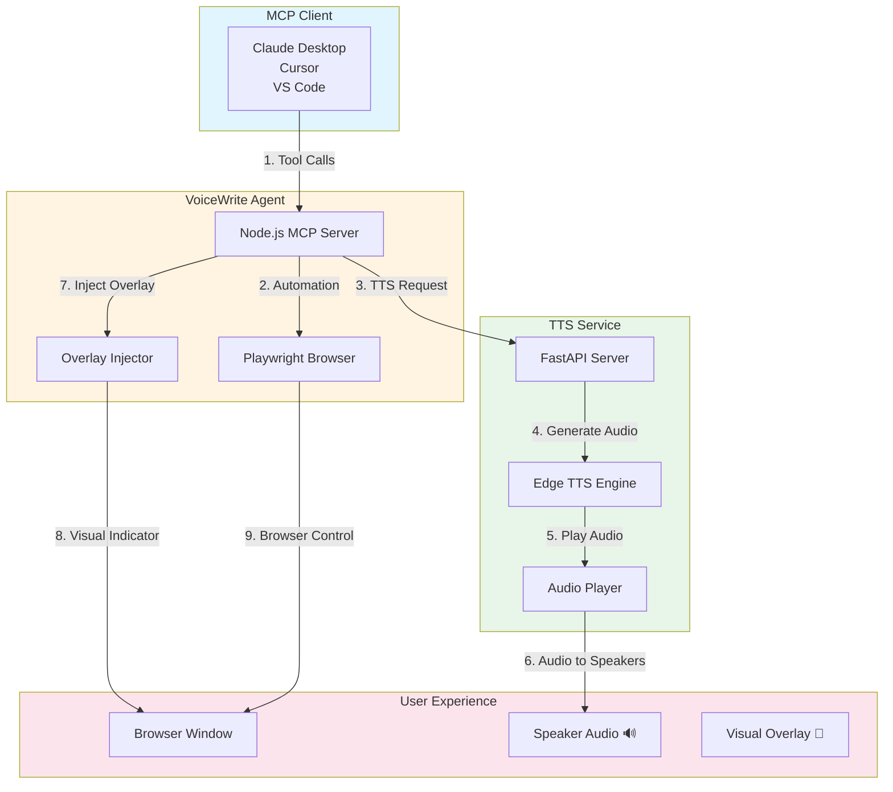
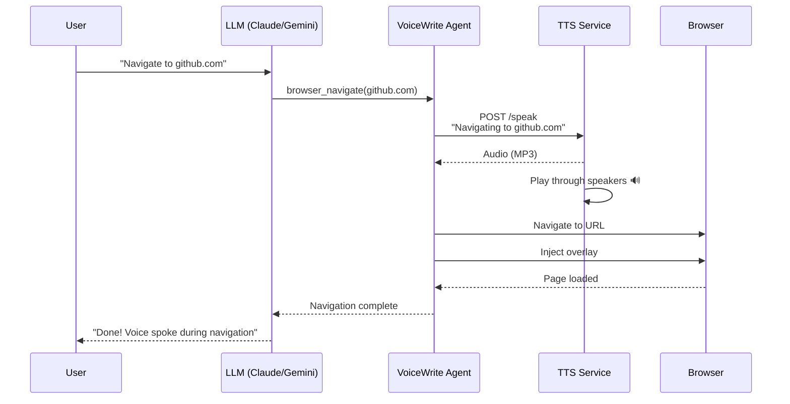

# 🎙️ VoiceWrite MCP

**Industry-Grade Browser Automation with Real-Time Voice Narration**

[](https://opensource.org/licenses/MIT)
[](https://www.docker.com/)
[](https://nodejs.org/)
[](https://www.python.org/)
[](https://modelcontextprotocol.io/)

> **VoiceWrite MCP** is a production-ready Model Context Protocol (MCP) server that enables AI assistants to control web browsers while narrating every action in real-time through high-quality text-to-speech. Perfect for transparent automation, accessibility, and AI demos.

---

## 🌟 Key Features

| Feature | Description |
|---------|-------------|
| 🎤 **Real-Time Voice** | High-quality Edge TTS narration for every browser action |
| 👁️ **Visual Overlay** | Premium red bubble indicator with Alt+J mute toggle |
| 🚀 **Production Ready** | Error handling, retries, rate limiting, timeouts |
| 🐳 **Dockerized** | Simple 2-container deployment (TTS + Agent) |
| 🔌 **MCP Compliant** | Works with Claude Desktop, Cursor, VS Code, and more |
| 📸 **Screenshots** | Capture and return page screenshots as images |
| 📜 **Smooth Scrolling** | Animated, visible scroll actions (1.5s duration) |
| 🎛️ **Multiple Modes** | Silent, minimal, or full narration modes |

---

## 🏗 System Architecture



### Component Flow



---

## 🚀 Quick Start

### Prerequisites

- **Docker & Docker Compose** (for TTS service)
- **Node.js 18+** (for agent)
- **USB Speakers/Headphones** (for audio output)
- **Linux/macOS/WSL** (Windows support via WSL2)

### 1-Minute Setup

```bash
# Clone the repository
git clone https://github.com/ARAVINDAN20/voice_write_mcp_plugin.git
cd voice_write_mcp_plugin

# Start all services
docker compose up -d

# Verify TTS is running
curl http://localhost:8000/health

# Build the agent
cd node-agent && npm install && npm run build

# Test voice output
curl -X POST http://localhost:8000/speak-sync \
  -H "Content-Type: application/json" \
  -d '{"text":"VoiceWrite is ready!", "voice":"af_heart"}'
```

**You should hear:** *"VoiceWrite is ready!"* through your speakers 🔊

> **💡 NO MODEL DOWNLOADS REQUIRED!**
>
> VoiceWrite uses **Edge TTS** (Microsoft Edge's neural TTS API):
> - ✅ **Free to use** - No API key, no credit card
> - ✅ **No model downloads** - Cloud-based (saves 500MB+ disk space)
> - ✅ **High-quality voices** - 10+ neural voice options
> - ✅ **Auto-cached** - Voices cached locally after first use
> - ✅ **Always updated** - Latest voices from Microsoft
>
> The TTS service automatically fetches voices from Microsoft's servers on-demand (first call may take 2-3 seconds, subsequent calls are instant).

---

## 📋 Table of Contents

- [🎯 What Can VoiceWrite Do?](#-what-can-voicewrite-do)
- [🔧 Installation Guide](#-installation-guide)
- [⚙️ Configuration](#️-configuration)
- [🎮 Usage Examples](#-usage-examples)
- [🔌 MCP Client Integration](#-mcp-client-integration)
- [📚 Sample Prompts Library](#-sample-prompts-library)
- [🏗 Architecture Details](#-architecture-details)
- [🛠 Development](#-development)
- [🐛 Troubleshooting](#-troubleshooting)
- [📄 License](#-license)

---

## 🎯 What Can VoiceWrite Do?

VoiceWrite MCP provides **6 core browser automation tools** with voice narration:

| Tool | Description | Voice Example |
|------|-------------|---------------|
| `browser_navigate` | Navigate to any URL | *"Navigating to github.com"* |
| `browser_click` | Click elements by selector | *"Clicking login button"* |
| `browser_type` | Type text into fields | *"Typing into search box"* |
| `browser_scroll` | Scroll page up/down | *"Scrolling down"* (smooth 1.5s) |
| `browser_screenshot` | Capture page screenshot | *"Taking a screenshot"* |
| `browser_evaluate` | Execute JavaScript | (Silent execution) |

### Real-World Use Cases

✅ **E-commerce Testing** - Navigate Amazon, search products, add to cart  
✅ **Form Automation** - Fill and submit forms with validation  
✅ **Web Scraping** - Navigate, scroll, screenshot, extract data  
✅ **Accessibility Demo** - Show AI controlling browser with voice  
✅ **Testing & QA** - Automated browser testing with narration  
✅ **Educational** - Teach web automation with voice explanations  

---

## 🔧 Installation Guide

### Option 1: Docker (Recommended)

```bash
# Pull and start TTS service
docker compose up -d

# Verify health
curl http://localhost:8000/health
# Expected: {"status":"ready","tts_available":true}
```

### Option 2: Local Development

```bash
# Install Node.js dependencies
cd node-agent
npm install
npm run build

# Test locally
node dist/index.js --voice --overlay --debug
```

### System Requirements

| Component | Minimum | Recommended |
|-----------|---------|-------------|
| CPU | 2 cores | 4+ cores |
| RAM | 4 GB | 8+ GB |
| Storage | 2 GB | 5+ GB |
| Network | Required | Broadband |
| Audio | Speakers/Headphones | USB Audio Device |

---

## ⚙️ Configuration

### Environment Variables

Create `.env` file in project root:

```bash
# TTS Service Configuration
TTS_PORT=8000
TTS_HOST=0.0.0.0

# Voice Settings
DEFAULT_VOICE=af_heart
DEFAULT_SPEED=1.0

# Agent Settings
TTS_SERVICE_URL=http://localhost:8000
NARRATION_MODE=full
```

### Agent CLI Flags

```bash
node dist/index.js [options]

Options:
  -v, --voice          Enable voice narration (default: true)
  --no-voice           Disable voice narration
  -o, --overlay        Enable visual overlay (default: true)
  --no-overlay         Disable visual overlay
  --mode <mode>        Narration mode: silent|minimal|full (default: full)
  --tts-url <url>      TTS service URL (default: http://localhost:8000)
  --headless           Run browser without UI
  --debug              Enable verbose logging
  -h, --help           Display help
```

### Narration Modes

| Mode | Navigate | Click | Type | Scroll | Screenshot | Error |
|------|----------|-------|------|--------|------------|-------|
| `silent` | ❌ | ❌ | ❌ | ❌ | ❌ | ✅ |
| `minimal` | ✅ | ❌ | ❌ | ❌ | ❌ | ✅ |
| `full` | ✅ | ✅ | ✅ | ✅ | ✅ | ✅ |

---

## 🎮 Usage Examples

### Basic Navigation

```bash
# Start agent
node node-agent/dist/index.js --voice --overlay
```

**Example Prompt:**
```
Open https://wikipedia.org and search for "Artificial Intelligence"
```

**What Happens:**
1. 🔊 Voice: *"Navigating to wikipedia.org"*
2. 🌐 Browser opens Wikipedia
3. 🔊 Voice: *"Typing into search box"*
4. ⌨️ Types "Artificial Intelligence"
5. 🔊 Voice: *"Clicking search button"*
6. 👆 Clicks search
7. 🔊 Voice: *"Scrolling down"* (smooth scroll)

### E-commerce Testing

**Example Prompt:**
```
Go to Amazon.com, search for "wireless headphones", 
filter by 4 stars, open first product, read the price
```

### Form Automation

**Example Prompt:**
```
Navigate to https://httpbin.org/forms/post
Fill in: Name=John, Email=john@example.com, Message=Testing
Submit the form
```

---

## 🔌 MCP Client Integration

### Claude Desktop

**Config Location:** `~/Library/Application Support/Claude/claude_desktop_config.json`

```json
{
  "mcpServers": {
    "voicewrite": {
      "command": "node",
      "args": [
        "/absolute/path/to/voice_write_mcp_plugin/node-agent/dist/index.js",
        "--voice",
        "--overlay"
      ]
    }
  }
}
```

### Cursor IDE

**Config Location:** `~/.cursor/mcp.json`

```json
{
  "mcpServers": {
    "voicewrite": {
      "command": "node",
      "args": [
        "/path/to/voice_write_mcp_plugin/node-agent/dist/index.js",
        "--voice",
        "--overlay",
        "--mode", "full"
      ]
    }
  }
}
```

### VS Code (with MCP Extension)

**Config Location:** `.vscode/mcp.json`

```json
{
  "servers": {
    "voicewrite": {
      "type": "stdio",
      "command": "node",
      "args": [
        "${workspaceFolder}/node-agent/dist/index.js",
        "--voice",
        "--overlay"
      ]
    }
  }
}
```

### Windsurf

**Config Location:** `~/.windsurf/mcp_config.json`

```json
{
  "mcpServers": {
    "voicewrite": {
      "command": "node",
      "args": [
        "/path/to/voice_write_mcp_plugin/node-agent/dist/index.js",
        "--voice",
        "--overlay"
      ]
    }
  }
}
```

---

## 📚 Sample Prompts Library

### 🔰 Beginner Prompts

```text
1. Open example.com and describe what you see
2. Navigate to google.com and search for "AI news"
3. Go to github.com and find the trending page
```

### 🛒 E-commerce Testing

```text
4. Open Amazon.com, search for "laptop stand", filter by price $20-50, 
   open first result, read title and price

5. Go to eBay, search for "iPhone 15 case", sort by lowest price, 
   click first item, check if it's in stock
```

### 📝 Form Testing

```text
6. Navigate to https://httpbin.org/forms/post
   Fill: Name=Alice, Email=alice@test.com, Comments=Great form!
   Submit and show confirmation

7. Go to a login page, enter credentials, submit, 
   and verify successful login
```

### 🎯 Advanced Workflows

```text
8. Open Hacker News, click top story, summarize the article, 
   return to homepage, click second story

9. Navigate to a product page, take screenshot, scroll to reviews, 
   read top 3 reviews, add to cart

10. Open multiple tabs, navigate to different sites, 
    compare prices, report findings
```

### 🐛 Error Handling Tests

```text
11. Open example.com, try to click "#nonexistent-element", 
    explain what error occurred

12. Navigate to invalid URL, handle the error gracefully, 
    try alternative URL
```

**📖 See [USAGE.md](./USAGE.md) for 50+ more prompts!**

---

## 🏗 Architecture Details

### High-Level Architecture

```
┌─────────────────────────────────────────────────────────────┐
│                     VoiceWrite MCP System                    │
├─────────────────────────────────────────────────────────────┤
│                                                              │
│  ┌──────────────┐     ┌──────────────┐     ┌──────────────┐ │
│  │ MCP Client   │────▶│ VoiceWrite   │────▶│   Browser    │ │
│  │ (Claude/etc) │     │   Agent      │     │  (Playwright)│ │
│  └──────────────┘     └──────────────┘     └──────────────┘ │
│                            │                       │         │
│                            ▼                       ▼         │
│                       ┌──────────────┐     ┌──────────────┐ │
│                       │   TTS        │     │   Overlay    │ │
│                       │   Service    │     │   (Red Bubble)│ │
│                       │  (Edge TTS)  │     │              │ │
│                       └──────────────┘     └──────────────┘ │
│                            │                                 │
│                            ▼                                 │
│                       ┌──────────────┐                      │
│                       │   Speakers   │                      │
│                       │   (Audio 🔊) │                      │
│                       └──────────────┘                      │
│                                                              │
└─────────────────────────────────────────────────────────────┘
```

### Technology Stack

| Layer | Technology | Purpose |
|-------|------------|---------|
| **MCP Protocol** | @modelcontextprotocol/sdk | Standard AI tool interface |
| **Browser Engine** | Playwright (Chromium) | Web automation |
| **TTS Engine** | Edge TTS (via edge-tts) | High-quality voice |
| **Audio Playback** | ffplay (FFmpeg) | System speaker output |
| **API Server** | FastAPI (Python) | TTS microservice |
| **Agent Runtime** | Node.js 18+ | MCP server host |
| **Containerization** | Docker Compose | Deployment orchestration |

**📖 See [ARCHITECTURE.md](./ARCHITECTURE.md) for detailed technical documentation!**

---

## 🛠 Development

### Project Structure

```
voice_write_mcp_plugin/
├── README.md                 # This file
├── ARCHITECTURE.md           # Technical architecture
├── INSTALLATION.md           # Installation guide
├── USAGE.md                  # Usage examples
├── API.md                    # API reference
├── CONTRIBUTING.md           # Contribution guide
├── docker-compose.yml        # Docker orchestration
├── .env.example              # Environment template
│
├── tts-service/              # Python TTS microservice
│   ├── Dockerfile
│   ├── main.py               # FastAPI application
│   └── requirements.txt
│
├── node-agent/               # Node.js MCP server
│   ├── package.json
│   ├── src/
│   │   ├── index.ts          # Main entry
│   │   └── overlay.ts        # Browser overlay
│   └── tsconfig.json
│
├── scripts/                  # Utility scripts
│   ├── start.sh
│   ├── stop.sh
│   └── health-check.sh
│
├── tests/                    # Test suite
│   ├── test-todo-page.js
│   ├── test-amazon.js
│   └── test-prompts.md
│
└── examples/                 # Configuration examples
    ├── claude-desktop-config.json
    ├── cursor-mcp-config.json
    └── vscode-mcp-config.json
```

### Running Tests

```bash
# Run all tests
npm test

# Run specific test
node tests/test-todo-page.js

# Test TTS directly
curl -X POST http://localhost:8000/speak-sync \
  -H "Content-Type: application/json" \
  -d '{"text":"Test", "voice":"af_heart"}'
```

---

## 🐛 Troubleshooting

### No Voice Playing

**Problem:** TTS generates audio but no sound from speakers

**Solutions:**
1. Check Docker has audio access: `docker compose restart tts-service`
2. Verify audio device: `aplay -l` (Linux) or check System Preferences (macOS)
3. Test TTS directly: `curl -X POST http://localhost:8000/speak-sync -d '{"text":"Test"}'`
4. Check logs: `docker logs voicewrite-tts`

**📖 See [AUDIO_TROUBLESHOOTING.md](./AUDIO_TROUBLESHOOTING.md) for detailed audio troubleshooting!**

### Browser Won't Open

**Problem:** Browser doesn't launch

**Solutions:**
1. Check Playwright browsers: `npx playwright install`
2. Run with debug: `node dist/index.js --debug`
3. Check permissions: Ensure user can launch GUI apps
4. Try headless mode: `node dist/index.js --headless`

### MCP Client Not Connecting

**Problem:** Claude/Cursor can't find VoiceWrite

**Solutions:**
1. Verify path in config is absolute
2. Check agent is running: `ps aux | grep voicewrite`
3. Test agent directly: `node dist/index.js --help`
4. Check MCP logs in client application

### Overlay Not Showing

**Problem:** Red bubble doesn't appear

**Solutions:**
1. Ensure `--overlay` flag is set
2. Check browser console for errors
3. Verify overlay script injected: Look for `[VoiceWrite] Overlay Active`
4. Try Alt+J to toggle visibility

---

## 📄 License

**MIT License** - See [LICENSE](./LICENSE) file for details.

```
Copyright (c) 2026 ARAVINDAN20

Permission is hereby granted, free of charge, to any person obtaining a copy
of this software and associated documentation files (the "Software"), to deal
in the Software without restriction, including without limitation the rights
to use, copy, modify, merge, publish, distribute, sublicense, and/or sell
copies of the Software, and to permit persons to whom the Software is
furnished to do so, subject to the following conditions:

The above copyright notice and this permission notice shall be included in all
copies or substantial portions of the Software.
```

---

## 🤝 Contributing

We welcome contributions! Please see [CONTRIBUTING.md](./CONTRIBUTING.md) for guidelines.

### Quick Start for Contributors

```bash
# Fork and clone
git clone https://github.com/ARAVINDAN20/voice_write_mcp_plugin.git
cd voice_write_mcp_plugin

# Install dependencies
cd node-agent && npm install
cd ../tts-service && pip install -r requirements.txt

# Make changes, then test
npm test

# Submit PR
git push origin feature/your-feature
```

---

## 📞 Support & Contact

- **GitHub Issues:** [Report bugs or request features](https://github.com/ARAVINDAN20/voice_write_mcp_plugin/issues)
- **Discussions:** [Ask questions or share ideas](https://github.com/ARAVINDAN20/voice_write_mcp_plugin/discussions)
- **Email:** aravindanm@karunya.edu.in

---

## 🙏 Acknowledgments

- **Model Context Protocol** - [MCP Specification](https://modelcontextprotocol.io/)
- **Playwright** - [Browser Automation](https://playwright.dev/)
- **Edge TTS** - [Microsoft Edge Text-to-Speech](https://github.com/rany2/edge-tts)
- **FastAPI** - [Modern Python Web Framework](https://fastapi.tiangolo.com/)

---

## 📈 Roadmap

- [ ] Multi-language TTS support (Spanish, French, German, etc.)
- [ ] Voice cloning support
- [ ] Browser extension for direct control
- [ ] Cloud deployment (AWS, GCP, Azure)
- [ ] WebSocket support for real-time streaming
- [ ] Mobile browser support (iOS Safari, Android Chrome)
- [ ] Advanced error recovery
- [ ] Performance optimization
- [ ] Plugin system for extensibility

---

**Made with ❤️ by ARAVINDAN20**

*Last Updated: February 2026*
